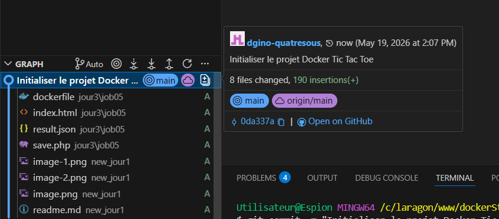
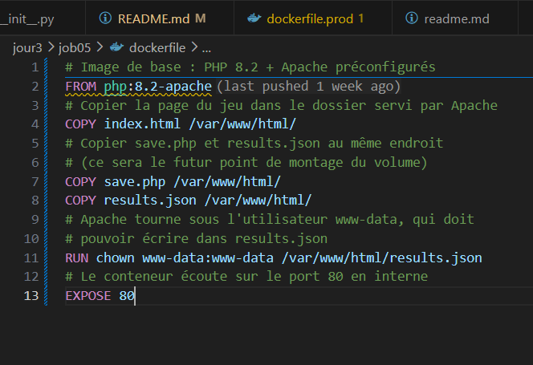
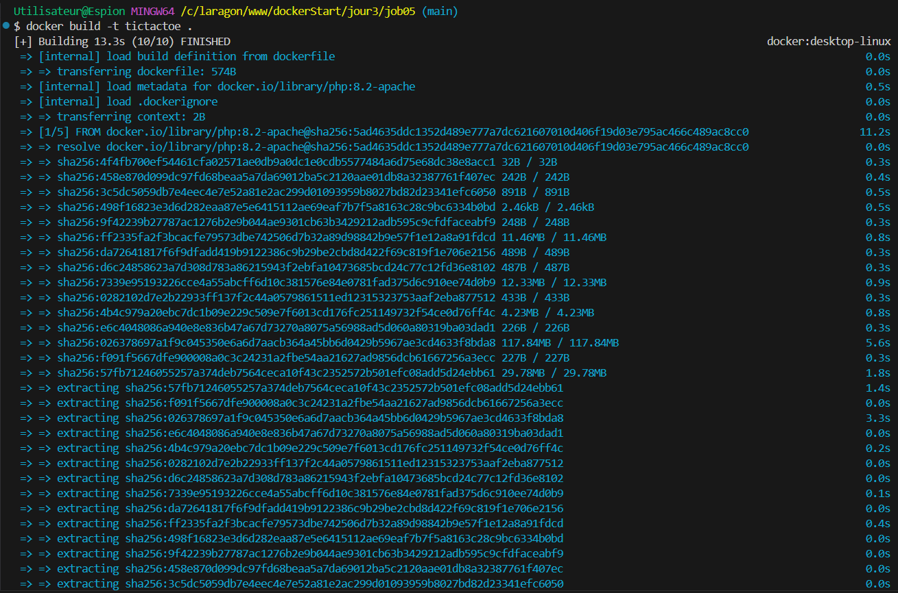
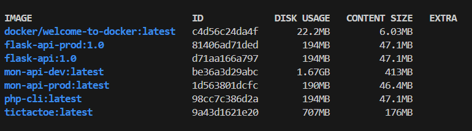
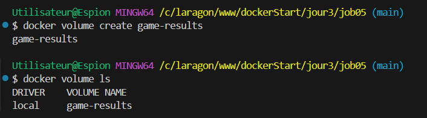
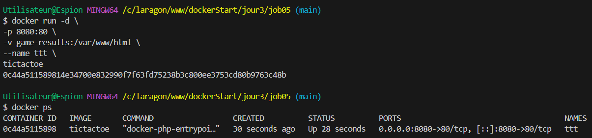
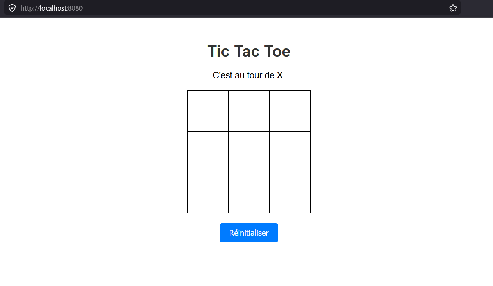
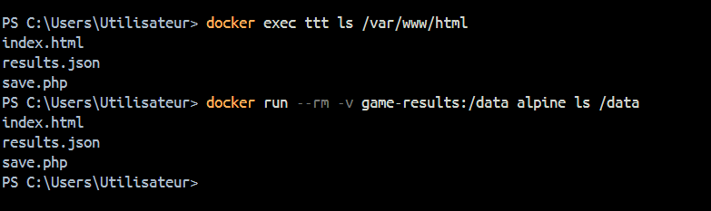

# dockerStart
jour1/job01/"hello screenshot.png"

Initialisation du Docker Tic Tac Toe

Création du Dockerfile et des fichiers

Build du docker et résultat

Check d'images

Creation du volume "game-result" et verification

Docker run et confirmation que le docker est en cours

Docker sur le navigateur

Vérification du contenue
